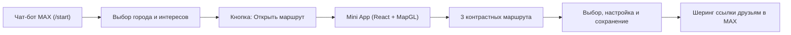

# Импульс Города (Impuls Goroda)

Цифровая платформа интеллектуального планирования и сопровождения городского досуга в мессенджере MAX. Решение разработано в рамках трека **«Досуг и развлечения»**.

> **Платформенный бонус MAX (+0,15 балла):**  
> Решение использует расширенные возможности платформы MAX сверх базовых требований:
> 1. **Глубокая связка Чат-бота и Mini App:** передача контекста через `initData` и deep links (`startapp=route_<token>`).
> 2. **MAX Bridge & MAX UI:** кроссплатформенная адаптация (Mobile iOS/Android + Web), нативные модальные диалоги, перехват закрытия и нативная геолокация.
> 3. **Анонимный шеринг карточек маршрутов в чаты MAX:** генерация защищённых токенов для открытия маршрута получателем в один клик без раскрытия личных данных автора.
> 4. **Интерактивные уведомления от бота:** доставка готового маршрута прямо в чат и проактивные оповещения об отмене сеансов с предложением адаптации расписания.

---

## 1. Назначение решения

«Импульс Города» решает проблему разрозненности информации о досуге, событиях и городских активностях. Вместо многочасового ручного поиска по афишам, картам и сайтам покупки билетов сервис за **10–15 секунд** формирует персонализированный, выполнимый и сбалансированный суточный план досуга.

Ключевые возможности:
* **Умная оптимизация расписания (TD-OPTW Beam Search):** математический алгоритм гарантирует успеваемость на сеансы с учётом времени на переходы, времени на вход, очередей и буферов.
* **Три контрастных сценария дня:** автоматический расчёт трёх альтернатив («Городской авангард», «История и наследие», «Движение и общество»).
* **Поддержка льготных программ («Пушкинская карта»):** строгий контроль бюджета, автоматический фильтр доступности оплаты по Пушкинской карте.
* **Мультигородская поддержка:** полноценная работа с двумя контрастными городами — **Москвой** (UTC+3) и **Пермью** (UTC+5), с учётом их специфики транспорта и часовых поясов.
* **Динамическая адаптация (Panic Button & Реакция на отмены):** пересчёт маршрута в реальном времени при опоздании пользователя или отмене сеанса организатором.
* **Встроенный гастрономический трек:** поиск кафе и перерывов на обед через интеграцию с картографическими сервисами рядом с текущей точкой прогулки.

---

## 2. Основной пользовательский сценарий



1. **Вход и выбор условий в боте:** пользователь открывает чат-бота в MAX, выбирает город (Москва / Пермь), указывает свои предпочтения, темп прогулки и бюджет (или выбирает один из 6 готовых тематических пресетов).
2. **Переход в Mini App:** бот формирует черновик условий и открывает интерактивное мини-приложение MAX.
3. **Генерация и выбор сценария:** ядро сервиса рассчитывает 3 выполнимых варианта на интерактивной карте с пошаговым расписанием и стоимостью.
4. **Сохранение и прохождение:** пользователь сохраняет выбранный маршрут, отмечает посещённые места или использует кнопку «Опаздываю» (Panic) для мгновенной адаптации оставшегося дня.
5. **Совместный досуг:** пользователь нажимает «Поделиться», отправляя нативную карточку в любой диалог MAX. Получатель открывает маршрут в своём приложении и может создать собственную копию плана.

---

## 3. Состав и архитектура решения

Проект построен по модульной архитектуре из трёх независимых сервисов на Go, клиентского приложения и инфраструктурного слоя:

```
┌────────────────────────────────────────────────────────┐
│                      Клиенты MAX                       │
│      [ Чат-бот MAX ]   ◄───►   [ Mini App (React 19) ] │
└──────────────────────────┬─────────────────────────────┘
                           │ HTTPS / REST (OpenAPI 3.1)
┌──────────────────────────▼─────────────────────────────┐
│                      gateway-svc                       │
│  - Авторизация MAX HMAC      - Управление сессиями     │
│  - Транзакционные команды    - Анонимный шеринг        │
│  - Доставка результатов      - Адаптер бота MAX        │
└──────────────┬───────────────────────────▲─────────────┘
               │ gRPC                      │ gRPC Lifecycle
┌──────────────▼─────────────┐ ┌───────────┴─────────────┐
│       optimizer-svc        │ │       syncer-worker     │
│  - Beam Search по TD-OPTW  │ │  - Сбор данных (OSM,    │
│  - Временные окна          │ │    Минкультуры, KudaGo) │
│  - Валидатор ограничений   │ │  - Temporal Workflows   │
│  - OSRM пешеходный/авто    │ │  - Карантин и DLQ       │
│  - Кэш срезов (Ristretto)  │ │  - Векторизация 384     │
└──────────────┬─────────────┘ └───────────┬─────────────┘
               │                           │
┌──────────────▼───────────────────────────▼─────────────┐
│                      Хранилища данных                  │
│  - PostgreSQL 16 (PostGIS + pgvector)                  │
│  - Redis Cluster (L2 кэширование и Pub/Sub)            │
│  - Apache Kafka (очереди сырых данных и DLQ)           │
│  - Temporal (оркестрация фонового импорта)             │
│  - OSRM Routing Engine (графы дорог OSM)               │
└────────────────────────────────────────────────────────┘
```

* **`gateway-svc`** (`services/gateway`): единая точка входа API (Echo v5), авторизация сессий по MAX HMAC, транзакционное управление маршрутами, шеринг, фоновая доставка уведомлений в чат.
* **`optimizer-svc`** (`services/optimizer`): высокопроизводительное вычислительное ядро на Go. Реализует эвристический Beam Search для задачи коммивояжера с временными окнами (TD-OPTW). Строго соблюдает бюджет, буферы, часы работы заведений и категорийное разнообразие.
* **`syncer-worker`** (`services/syncer`): фоновый контур интеграции и материализации данных. Сбор внешних источников, Landing Zone, дедупликация, валидация геометрии, карантин битых данных и мгновенная доставка отмен в Gateway.
* **`web`** (`web`): клиентское Mini App на React 19, MAX Bridge, стилизованное по гайдлайнам MAX UI, с векторными картами 2ГИС MapGL.

---

## 4. Запуск всех локальных компонентов через Docker

Все компоненты решения (сервисы, БД, брокеры, воркеры и прокси) запускаются **одной командой**:

```bash
docker compose -f compose.product.yaml up -d
```

Или с помощью `Makefile`:
```bash
cp .env.example .env
make up
```

Команда автоматически:
1. Поднимает PostgreSQL с расширениями PostGIS и pgvector;
2. Накатывает миграции схемы БД;
3. Поднимает Redis, Kafka и Temporal;
4. Запускает `gateway-svc`, `optimizer-svc`, `syncer-worker` и веб-сервер Caddy;
5. Проводит healthcheck готовности всех контейнеров.

Сборка локальных образов оптимизирована (multi-stage build на базе scratch/alpine) и занимает **менее 3 минут**, что полностью укладывается в норматив регламента (до 5 минут).

---

## 5. Параметры и переменные окружения

Все переменные окружения документированы в файле [`.env.example`](file:///.env.example). Для локального запуска достаточно скопировать его в `.env`:

```bash
cp .env.example .env
```

### Основные переменные:

| Переменная | Назначение | Значение по умолчанию / Пример |
|---|---|---|
| `APP_ENV` | Режим окружения | `production` / `local` |
| `MAX_BOT_TOKEN` | Токен авторизации бота в платформе MAX | Токен от организаторов |
| `MAX_BOT_USERNAME` | Юзернейм бота в MAX для генерации deep links | `ImpulsGorodaBot` |
| `MAX_INIT_DATA_SECRET` | Секретный ключ для валидации HMAC `initData` | Секрет платформы MAX |
| `TWO_GIS_API_KEY` | Ключ доступа к тайлам и поиску 2ГИС | Ключ API 2ГИС |
| `POSTGRES_USER` | Пользователь БД | `impuls_admin` |
| `POSTGRES_PASSWORD` | Пароль администратора БД | Задаётся в `.env` |
| `POSTGRES_DB` | Имя базы данных | `impuls_goroda` |
| `GATEWAY_NOTIFICATION_DELIVERY_ENABLED` | Доставка уведомлений об отменах в MAX | `true` |
| `GATEWAY_SCENARIO_RESULT_DELIVERY_ENABLED` | Отправка карточки маршрута в чат бота | `true` |
| `OSRM_FOOT_URL` | Адрес пешеходного роутера OSRM | `http://osrm-foot:5000` |
| `OSRM_CAR_URL` | Адрес автомобильного роутера OSRM | `http://osrm-car:5000` |

---

## 6. Используемые порты

При локальном запуске порты привязаны к локальному интерфейсу `127.0.0.1`:

| Порт хоста | Сервис | Описание |
|---|---|---|
| **80 / 443** | Caddy / Nginx Edge | Публичный HTTPS эндпоинт Mini App и REST API `/api/v1` |
| **8080** | gateway-svc | Внутренний HTTP REST API шлюза |
| **50051** | optimizer-svc | Внутренний gRPC API вычислительного ядра |
| **5432** | PostgreSQL | Основная СУБД (PostGIS + pgvector) |
| **8233** | Temporal UI | Веб-интерфейс мониторинга оркестрации задач |
| **9091** | Prometheus | Метрики производительности сервисов |
| **16686** | Jaeger UI | Распределённая трассировка запросов (OpenTelemetry) |

---

## 7. Зависимости

* **Backend:** Go 1.27.1+ (единый корневой модуль `go.mod`).
* **Frontend:** Node.js 20+, npm, Vite, React 19.2+, MAX Bridge, 2GIS MapGL JS API.
* **Инфраструктура:** Docker 24+, Docker Compose v2.20+.
* **Внешние библиотеки и движки:** OSRM (Open Source Routing Machine), PostgreSQL 16 с расширениями PostGIS 3.4 и pgvector 0.7.

---

## 8. Внешние сервисы и интеграции

1. **Платформа MAX (Платформа для бизнеса):**
   * Bot API (long polling / webhook) для диалогового взаимодействия;
   * Авторизация пользователей через проверку криптографической подписи HMAC-SHA256 параметров `initData`;
   * MAX Bridge SDK для нативной интеграции с клиентами iOS, Android и Web.
2. **Картография и геопоиск:**
   * **2ГИС:** отображение интерактивных векторных карт через MapGL и поиск заведений питания вокруг текущих координат;
   * **OSRM на данных OpenStreetMap:** расчёт пешеходных и автомобильных матриц расстояний и времени пути без зависимости от платных проприетарных API.
3. **Источники каталога досуга:**
   * **PRO.Культура.РФ / Минкультуры России:** события, выставки, музеи, фестивали;
   * **KudaGo API:** городские активности, культурная и фестивальная афиша;
   * **OpenStreetMap (Overpass API):** достопримечательности, парки, архитектурные памятники, общепит.

---

## 9. Описание работы с данными

В строгом соответствии с требованиями регламента (п. 10 ограничений, стр. 7 и 18 PDF), сервис гарантирует прозрачность происхождения данных:
* **`live`**: данные, для которых подтверждена актуальность в рамках выбранного источника.
* **`prepared`**: заранее собранные и материализованные записи источников; этот режим сам по себе не подтверждает наличие мест или актуальность сеанса.
* **`synthetic`**: смоделированные для стенда данные (тестовые сеансы и события на ближайшие дни).
Каждая карточка и ответ API содержат явный атрибут `data_mode` (`live` / `prepared` / `synthetic`). Никакие модельные данные не выдаются за подтверждённые факты.

Для связи с MAX хранится идентификатор аккаунта и защищённый токен сессии. Частные координаты и сведения об участии не включаются в общую проекцию маршрута.

---

## 10. Порядок работы с тестовыми данными

Для демонстрации обоих городов (Москва и Пермь) в сервис включён генератор тестовых данных с актуальным горизонтом сеансов на 14 дней вперёд.

Для инициализации тестовых данных выполните команду:
```bash
# Генерация тестовых наборов для Москвы и Перми от текущей даты
docker compose -f compose.yaml -f compose.product.yaml exec syncer /app/syncer seed --from $(date +%Y-%m-%d)
```

Команда создаёт синтетический демонстрационный набор. Его события, цены и доступность не являются подтверждёнными сведениями поставщиков.

---

## 11. Пошаговый сценарий проверки

### Вариант А: Проверка в мессенджере MAX (Основной сценарий)
1. Откройте чат-бота в MAX по ссылке, предоставленной командой.
2. Отправьте `/start` и выберите одну из тем либо опишите свой день текстом.
3. Нажмите кнопку **«Открыть маршрут»** — загрузится Mini App.
4. В Mini App уточните город, время, старт и ограничения, затем запустите расчёт. При наличии допустимых вариантов:
   * переключайте варианты вверху экрана;
   * просмотрите карточки событий, стоимость (с учётом Пушкинской карты) и нитку маршрута на карте.
5. Выберите вариант и сохраните маршрут.
6. Создайте ссылку через **«Поделиться»**. Получатель может открыть разрешённую проекцию без личных данных владельца. Создание независимой копии получателем пока не подключено.
7. Нажмите кнопку **«Опаздываю» (Panic)**, выберите задержку 30 минут — сервис предложит безопасную адаптацию расписания без потери ключевых билетов.

### Вариант Б: Проверка через автоматизированный манифест DATA-API.yaml
Манифест [DATA-API.yaml](DATA-API.yaml) описывает проверки опубликованных методов. Для защищённых вызовов нужен токен после действительного обмена MAX `initData`; маршрут, revision и share token берутся из предыдущих ответов. Пример запроса с подтверждёнными параметрами на актуальную дату:
```bash
curl https://impulsgoroda.duckdns.org/api/v1/health/ready

curl -X POST https://impulsgoroda.duckdns.org/api/v1/routes/optimize \
  -H "Content-Type: application/json" \
  -H "Authorization: Bearer ${TEST_USER_TOKEN}" \
  -H "Idempotency-Key: $(cat /proc/sys/kernel/random/uuid)" \
  --data-binary @- <<EOF
{
    "city": "moscow",
    "timezone": "Europe/Moscow",
    "start_at": "${START_AT}",
    "end_at": "${END_AT}",
    "origin": {"latitude": 55.7558, "longitude": 37.6173},
    "constraints": {
      "interest_mask": "0x0000000000000021",
      "excluded_categories": [],
      "movement_modes": ["walk"],
      "load_profile": "moderate",
      "benefit_programs": [],
      "audience_claims": [],
      "obligations": [],
      "soft_preferences": [],
      "accepted_unknowns": [],
      "pushkin_card_only": false,
      "budget": {"mode": "none"}
    }
}
EOF
```

`START_AT` и `END_AT` задаются в RFC 3339 на день, для которого наполнен каталог; начало должно быть раньше конца. Ответ может содержать 0–3 варианта, включая объяснённый отказ.

---

## 12. Примеры ожидаемого поведения системы

### Пример успешного ответа расчёта маршрута (`status: READY`):
Сервис возвращает массив приватных черновиков. Времена и переходы находятся внутри `plan`; фактическое число вариантов зависит от каталога и ограничений. Ниже сокращённый фрагмент структуры ответа, а не готовый fixture:
```json
{
  "status": "READY",
  "request_id": "11111111-1111-4111-8111-111111111111",
  "data_mode": "synthetic",
  "computation_time_ms": 12,
  "routes": [
    {
      "route_id": "550e8400-e29b-41d4-a716-446655440000",
      "revision": "1",
      "lifecycle": "draft",
      "city": "moscow",
      "plan": {"result": "READY", "steps": [], "legs": []}
    }
  ],
  "warnings": [],
  "conflicts": []
}
```

### Пример корректного отказа при невыполнимых ограничениях (`status: NO_FEASIBLE_ROUTE`):
Если пользователь задал слишком узкое временное окно или несовместимые точки:
```json
{
  "status": "NO_FEASIBLE_ROUTE",
  "request_id": "11111111-1111-4111-8111-111111111112",
  "data_mode": "prepared",
  "computation_time_ms": 8,
  "routes": [],
  "warnings": [
    {"code": "TIME_WINDOW_TOO_NARROW", "scope": "route", "message": "Для выбранного окна нет допустимого плана"}
  ],
  "conflicts": []
}
```

---

## 13. Известные ограничения

1. **Точность геолокации:** в закрытых помещениях веб-версия MAX может отдавать координаты с погрешностью; в интерфейсе предусмотрен ручной выбор точки старта касанием карты.
2. **Внешние провайдеры:** при их недоступности поиск кафе и свежесть данных могут деградировать; сохранённый маршрут доступен при работающем хранилище.
3. **Авторизация:** токен сессии выдаётся после проверки настоящего MAX `initData`. Фиксированный `test_jury_token` не поддерживается.

---

## 14. Порядок остановки и повторного запуска решения

### Приостановка работы (сохранение всех данных в томах):
```bash
docker compose -f compose.product.yaml stop
```

### Возобновление работы:
```bash
docker compose -f compose.product.yaml start
```

### Полная остановка контейнеров:
```bash
docker compose -f compose.product.yaml down
```
*(База данных, срезы каталогов и графы дорог сохраняются в именованных docker volumes и не теряются при перезапуске).*

---

## 15. Внешние сервисы, необходимые для работы MVP

Для полноценной работы сценария используются следующие сервисы:
1. **Публичный адрес шлюза (HTTPS):** `https://impulsgoroda.duckdns.org` (автоматический сертификат Let's Encrypt через Caddy). Необходим для работы Webhook платформы MAX и загрузки Mini App по HTTPS.
2. **MAX Platform API:** сервер `https://platform-api.max.ru` для приёма вебхуков и отправки ответов бота.
3. **2ГИС MapGL и Places API:** CDN-скрипты карты и векторные тайлы для визуализации геометрии маршрутов.
